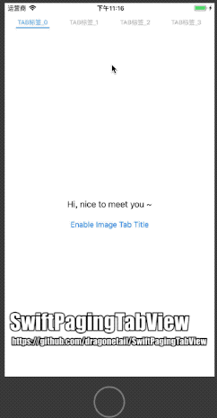

# SwiftPagingTabView

[](https://cocoapods.org/pods/SwiftPagingTabView)
[](https://cocoapods.org/pods/SwiftPagingTabView)
[](https://swift.org/)
[](https://www.apple.com/ios/ios-9/)
[](https://cocoapods.org/pods/SwiftPagingTabView)



## Example

To run the example project, clone the repo, and run `pod install` from the Example directory first.

## Requirements

- Swift 4.2
- iOS 9.0+
- Xcode 10.1


## Installation

SwiftPagingTabView is available through [CocoaPods](https://cocoapods.org). To install
it, simply add the following line to your Podfile:

```ruby
platform :ios, '11.0'
use_frameworks!
pod 'SwiftPagingTabView'
```

To get the full benefits import `SwiftPagingTabView` wherever you import UIKit

``` swift
import UIKit
import SwiftPagingTabView
```

## Usage example

#### Programmatically

```swift
import UIKit
import SwiftPagingTabView

class ViewController: UIViewController {

    public lazy var pagingTabView: PagingTabView = {
        let pagingTabView: PagingTabView = PagingTabView()
        pagingTabView.config = PagingTabViewConfig()
        pagingTabView.delegate = self
        pagingTabView.datasource = self

        return pagingTabView
    }()

    override func viewDidLoad() {
        super.viewDidLoad()

        self.view.addSubview(pagingTabView)

        pagingTabView.reloadAndSetup()
    }

extension ViewController: PagingTabViewDelegate {
    func pagingTabView(pagingTabView: PagingTabView, toIndex: Int) {
        print("Switch to paging tab view: \(toIndex)")
    }

    func reconfigure(pagingTabView: PagingTabView) {
        pagingTabView.tabButtons.forEach { (tabButton) in
            tabButton.configure(config: TabButtonConfig())
        }
    }
}
extension ViewController: PagingTabViewDataSource {
    func segments(pagingTabView: PagingTabView) -> Int {
        return 4
    }

    func tabTitle(pagingTabView: PagingTabView, index: Int) -> (image: UIImage?, title: String?) {
        if commandView.isEnableImageTitle {
            return (image: UIImage(named: "menu"),
                    title: "TAB标签_" + String(index))
        } else {
            return (image: nil,
                    title: "TAB标签_" + String(index))
        }
    }

    func tabView(pagingTabView: PagingTabView, index: Int) -> UIView {
        if index == 0 {
            return commandView
        } else {
            let view = UILabel()
            view.backgroundColor = UIColor.white
            view.text = "View " + String(index)
            view.textAlignment = .center
            return view
        }
    }
}
```

## Author

dragonetail, dragonetail@gmail.com

## License

SwiftPagingTabView is available under the MIT license. See the LICENSE file for more info.
