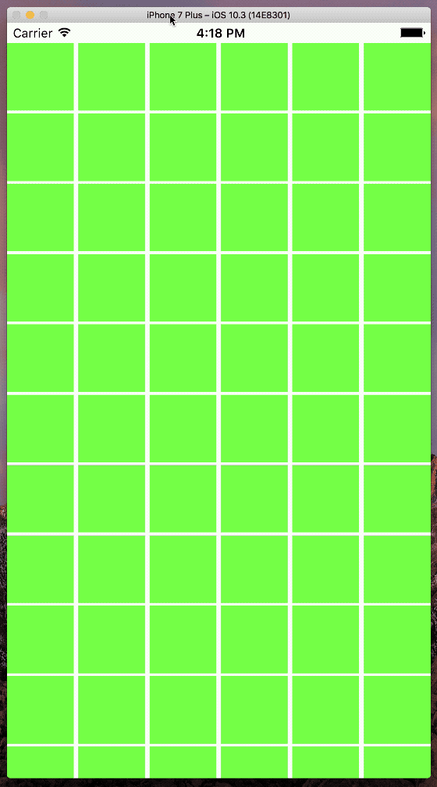
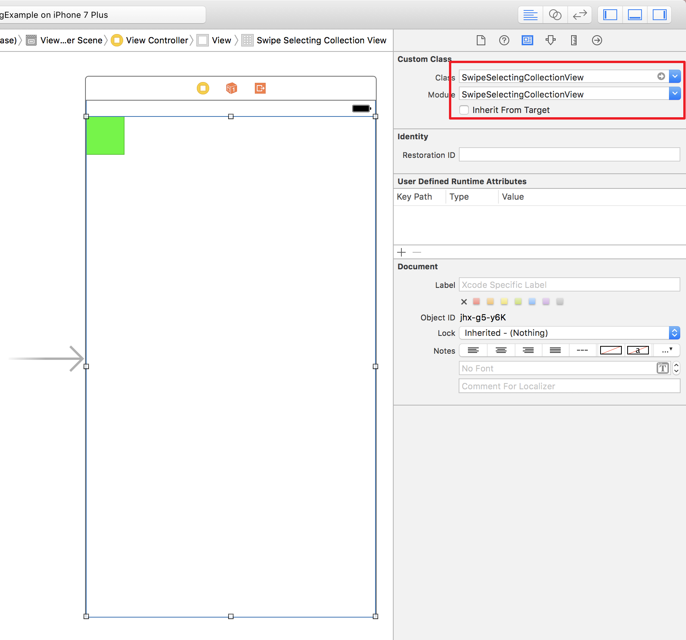

# SwipeSelectingCollectionView2
> A collection view subclass that enables swipe(finger over) to select multiple cells just like in Photos app.  
This project is derived from SwipeSelectingCollectionView(https://github.com/ShaneQi/SwipeSelectingCollectionView)

[](https://swift.org/)
[](https://www.apple.com/ios/ios-9/)



## Requirements

- Swift 4.2
- iOS 9.0+
- Xcode 10.1

## Installation

#### CocoaPods
You can use [CocoaPods](http://cocoapods.org/) to install `SwipeSelectingCollectionView` by adding it to your `Podfile`:

```ruby
platform :ios, '11.0'
use_frameworks!
pod 'SwipeSelectingCollectionView2'
```

To get the full benefits import `SwipeSelectingCollectionView2` wherever you import UIKit

``` swift
import UIKit
import SwipeSelectingCollectionView2
```

#### Manually
1. Download and drop ```SwipeSelectingCollectionView.xcodeproj``` in your project.  
2. Congratulations!  

## Usage example

#### Programmatically

```swift
import SwipeSelectingCollectionView2

let collectionView = SwipeSelectingCollectionView(frame: .zero, collectionViewLayout: UICollectionViewFlowLayout()) 
```
#### Added SwipeUICollectionViewDelegate  
Delegate when the tap event recognized. If the cell was seleced, deselect the cell item and trigger the delegation *didDeselectItemAt*, otherwise just trigger the *didSelectItemAtByTapped* in *SwipeUICollectionViewDelegate* like blow.    
```swift
import SwipeSelectingCollectionView2

extension ViewController: SwipeUICollectionViewDelegate {
    func collectionView(_ collectionView: UICollectionView, didSelectItemAtByTapped indexPath: IndexPath) {
        print("didSelectItemAtByTapped: \(indexPath)")
        collectionView.selectItem(at: indexPath, animated: false, scrollPosition: [])
    }
}
```

#### Interface Builder



## Contribute

We would love you for the contribution to **SwipeSelectingCollectionView**, check the ``LICENSE`` file for more info.

## Meta

### Original Auther:
Shane Qi – [@shadowqi](https://twitter.com/shadowqi) – qizengtai@gmail.com

### Updated by:
dragonetail – dragonetail@gmail.com  

Distributed under the Apache License 2.0. See ``LICENSE`` for more information.

[https://github.com/shaneqi/SwipeSelectingCollectionView2](https://github.com/shaneqi/SwipeSelectingCollectionView2)
